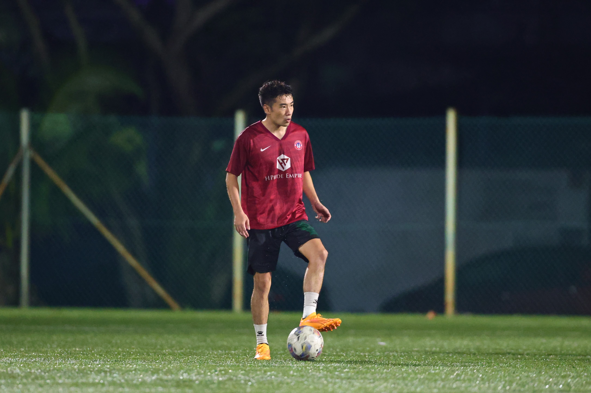

{:style="float: right; padding: 30px; max-width: 30%;"}
Hi there! Welcome to my home page. 

I’m Peiqiang Yin, an sport researcher with a deep interest in sport talent development.I research how football environments affect youth talent development—especially how things like coaching, resources, and family support shape young athletes' growth. I use quantitative tools to compare different systems across countries and help design better, evidence-based programs.
Currently, I'm pursuing a Master of Sports Sicience at the Facuty of Sport & Exercise, University of Malaya. My academic journey involves extensive research in talent development environment, particularly exploring the youth football players in these fields. My early research includes significant work on the development environment of Chinese youth campus football. For a more detailed overview of my work, please visit my [Research page](/_pages/research.md)

**I am actively seeking PhD positions for Fall 2025 or Spring 2026 intake.** If my research interests align with yours, or if you have opportunities that fit my background, I would love to connect! 

If you have any questions, please feel free to [reach out](mailto:yinpeiqiang29@gmail.com) to me. I believe communication is the foundation of academic progress.
## Recent News
last updated: April 02nd, 2025

- The research project I led during my master’s program, [The key factors of talent development environment for campus football athletes in China](https://www.tandfonline.com/doi/full/10.1080/23311886.2024.2431590), has been published for the **Cogent Social Sciences**.

During my undergraduate period, I mostly studied in school as an athlete. Have a lot of sports training experience. During this period, he was awarded the AFC Level C coach and the Chinese National Level One football referee.
As a football player, he won good results in national competitions.
## Visitors

