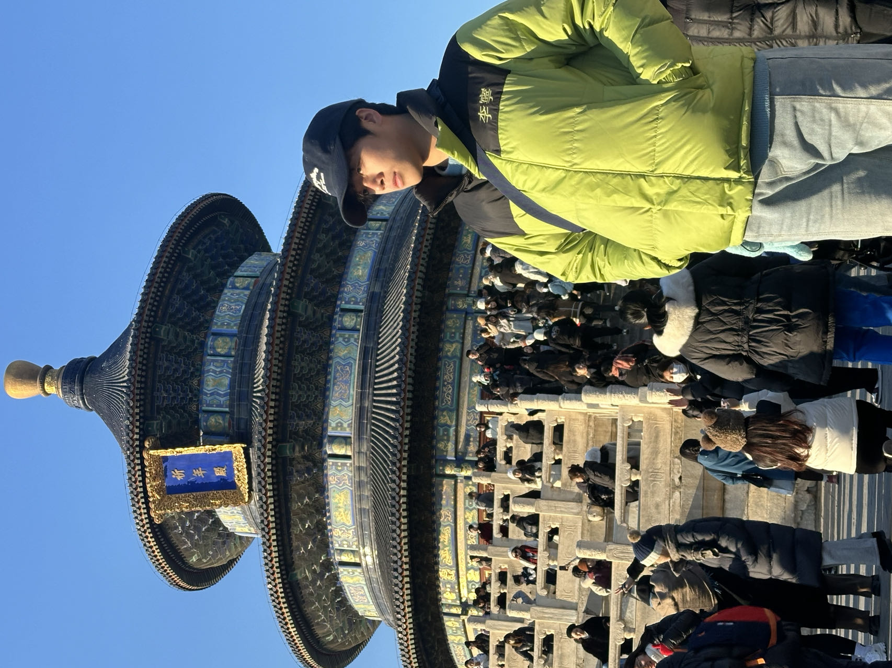

{:style="float: right; padding: 30px; max-width: 30%;"}

Hi there! Welcome to my home page. 

I'm ChingyCheng. I'm an AI researcher and Biomathematics.

Currently, I'm a rising senior at Yuncheng University studying Math and Applied Math . I spend a lot of time doing research on Data Analysis, Future Research Directions in Biomathematics and Data Analysis，I am also very interested in deep learning，I did some research on earthquakes in my sophomore year.Checkout my [research page](/_pages/research.md) for more information.

I am currently preparing for graduate school fall 2023.

Outside of this, I like to  play soccer, play my guitar(seldom),and watch cartoon . 

If you'd like to get in contact with me, simply email me at [chingycheng@foxmail.com](mailto:chingycheng@foxmail.com).

## Recent News
last updated: July 12th, 2022
- The research project I participate on my Sophomore summer [Research on seismic discrimination based on particle swarm optimization generalized regression neural network and HHT sample entropy](https://kns.cnki.net/kcms/detail/detail.aspx?filename=DQWJ2022031500J&dbcode=DKFX&dbname=DKFX2022&v=S8LCx_iKxHZwzIf37irYxfUIXBeHlC8GhgF9dyL40h0xJzBSgRmLQGvkJc3gwpjH)  has been published on the Progess in Geophysics.
- The research project I participate on my Sophomore summer [Research on Identification of Seismic Event Properties Based on Least Squares Support Vector Machine and Entropy Feature](https://kns.cnki.net/kcms/detail/detail.aspx?doi=10.14075/j.jgg.2022.06.019) has been published on the Journal of Geodesy and Geodynamics.
- Our work [Decision-making platform for mine mcroseismic monitoring network layout plan based on TOPSIS and ZedGraph graphic controls](https://kns.cnki.net/kcms/detail/detail.aspx?dbcode=CJFD&dbname=CJFDAUTO&filename=SYXZ202203001&uniplatform=NZKPT&v=WQLhOUsEE2Ny13mKBzFFTg1MH4UfiBiMihiJSvVAzbPdTDJxVhDcT2K3elAZkcIw) is accepted !
